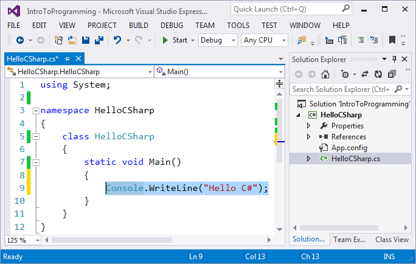

# Programas de Computadora – Conceptos

Comencemos con los conceptos de programación de **computadoras**: programas de computadora, algoritmos, lenguajes de programación, compilación y ejecución de código.

## ¿Qué significa "programar"?

**Programar** significa **dar comandos** a la computadora, por ejemplo, "_reproducir un sonido_", "_imprimir algo en la pantalla_" o "_multiplicar dos números_". Cuando los comandos son uno tras otro, se llaman **un programa de computadora**. El texto de los programas de computadora se llama código de programa (o código **fuente**, o incluso **código** más **corto).**

Ejemplo de **comando** para el equipo:

```csharp
Console.WriteLine("Welcome to coding");
```

Run the above code example: [https://repl.it/@nakov/welcome-to-coding-csharp](https://repl.it/@nakov/welcome-to-coding-csharp).

When **executed**, the above command prints the following text:

```
Welcome to coding
```

## Programas de computadora

**Los programas de computadora** representan **una secuencia de comandos** que están escritos en cierto **lenguaje de programación**, como C #, Java, JavaScript, Python, C ++, PHP, C, Ruby, Swift, Go u otro.

Ejemplo de **programa informático** en C#:

```csharp
using System;

class SquareArea
{
    public static void Main()
    {
        var size = 5;
        Console.WriteLine("Size = " + size);
        Console.WriteLine("Area = " + size * size);
    }
}
```

Run the above code example: [https://repl.it/@nakov/square-area-csharp](https://repl.it/@nakov/square-area-csharp).

El programa anterior define una **clase** , que contiene un **método** , que contiene una secuencia de **3 comandos** `SquareArea Main()`

1. Declarar y asignar una **variable**: `var size = 5;`
2. Calcular e **imprimir** una **expresión**: `Console.WriteLine("Size = " + size);`
3. Calcular e **imprimir** una **expresión**: `Console.WriteLine("Area = " + size * size);`

Calcular e **imprimir** una **expresión**:

```
Size = 5
Area = 25
```

**Explicaremos en detalle cómo escribir programas en C #**, por qué necesitamos definir una **clase** y por qué necesitamos definir un **método** un poco más tarde. Ahora, supongamos que el lenguaje C # requiere todo el código anterior para ejecutar una secuencia de comandos.`Main()`

Para escribir comandos, debemos conocer la **sintaxis y la semántica del lenguaje con el** que estamos trabajando, en nuestro caso, **C #**. Por lo tanto, vamos a familiarizarnos con la sintaxis y la semántica del lenguaje C #, y con la programación en general, en el presente libro, aprendiendo paso a paso la escritura de código desde las construcciones de programación más simples hasta las más complejas.

## Algoritmos <a href="#algorithms" id="algorithms"></a>

Los programas informáticos suelen ejecutar algún algoritmo. **Los algoritmos** son una **secuencia de pasos**, necesarios para completar una determinada tarea y para obtener algún resultado esperado, algo así como una "receta".

Por ejemplo, si freímos huevos, seguimos alguna receta (un algoritmo): calentamos el aceite en una sartén, rompemos los huevos dentro de ella, esperamos a que se frían y los alejamos de la estufa.

Del mismo modo, en la programación, **los programas informáticos ejecutan algoritmos**: una secuencia de comandos, necesarios para completar una determinada tarea. Por ejemplo, para organizar una secuencia de números en orden ascendente, se necesita un algoritmo, por ejemplo, encontrar el número más pequeño e imprimirlo, luego encontrar el número más pequeño entre el resto de los números e imprimirlo, y esto se repite hasta que no queden más números.

Para mayor comodidad al crear programas, para escribir código de programación, para la ejecución de programas y otras operaciones relacionadas con la programación, necesitamos un **entorno de desarrollo**, por ejemplo, Visual Studio.

## Lenguajes de programación, compiladores, intérpretes y entornos de desarrollo <a href="#programming-languages-compilers-interpreters-and-development-environments" id="programming-languages-compilers-interpreters-and-development-environments"></a>

Repasemos algunos conceptos de la programación informática: lenguajes de programación, compiladores, intérpretes y entornos de desarrollo (IDE).

### Lenguajes de programación <a href="#programming-languages" id="programming-languages"></a>

**Un lenguaje de programación** es un lenguaje artificial (sintaxis para expresión), destinado a **dar comandos** que queremos que la computadora lea, procese y ejecute. Usando lenguajes de programación, escribimos secuencias de comandos (**programas**), que **definen lo que la computadora debe hacer**. Ejemplos de lenguajes de programación son C #, Java, JavaScript, Python, C, C ++, PHP, Swift, Go y muchos otros. Estos lenguajes difieren en su filosofía, sintaxis, propósito, construcciones de programación y entorno de ejecución. La ejecución de programas informáticos se puede hacer con un **compilador** o con **un intérprete**.

### Compiladores <a href="#compilers" id="compilers"></a>

**El compilador** traduce el código del lenguaje de programación al código máquina, ya que para cada una de las construcciones (comandos) en el código elige un fragmento de **código máquina** adecuado y previamente preparado y, mientras tanto, **verifica el texto del programa en busca de errores**. Juntos, los fragmentos compilados comprenden el programa en un código máquina, como lo espera el microprocesador de la computadora. Después de que el programa ha sido compilado, se puede ejecutar directamente desde el microprocesador en cooperación con el sistema operativo. Con los lenguajes de programación basados en compiladores, **la compilación del programa** se realiza obligatoriamente antes de su ejecución, y se encuentran errores de sintaxis (comandos incorrectos) durante el tiempo de compilación. Lenguajes como C++, C#, Java, Swift y Go funcionan con un **compilador**. Este es un ejemplo de cómo puede verse la ejecución del compilador (el compilador basado en consola):`dotnet`



