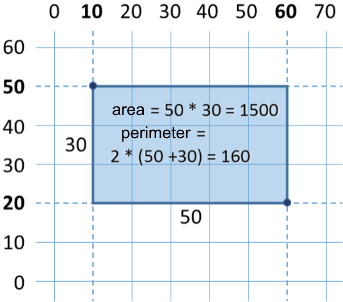

# Problem: Rectangle Area

A **rectangle** is defined by the **coordinates** of both of its opposite corners (x1, y1) – (x2, y2). Calculate its **area and perimeter**. **The input** is read from the console. The numbers **x1, y1, x2 and y2** are given one per line. **The output** is printed on the console and it has to contain two lines, each with one number – the area and the perimeter.

## Sample Input and Output

| Input                                       | Output                     |
| ------------------------------------------- | -------------------------- |
| 
60 20 10 50
                 | 
1500 160
         |
| 
30 40 70 -10
                | 
2000 180
         |
| 
600.25 500.75 100.50 -200.5
 | 
350449.6875 2402
 |

## Video: Rectangle Area

Watch the video lesson about calculating rectangle area: https://youtu.be/IHb\_Tz-EVT4.

## Testing in the Judge System

Test your solution here: [https://judge.softuni.org/Contests/Practice/Index/504#6](https://judge.softuni.org/Contests/Practice/Index/504#6).
