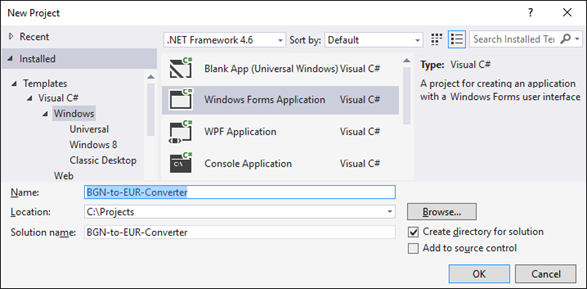
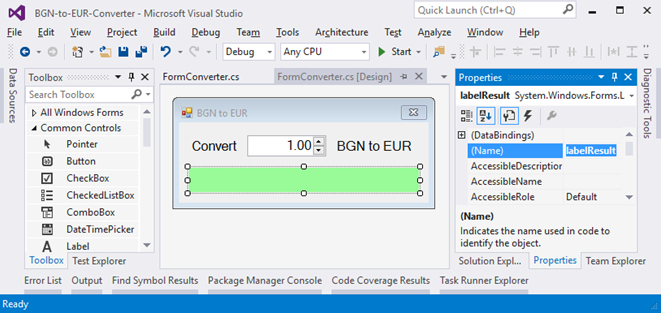
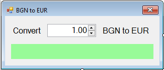
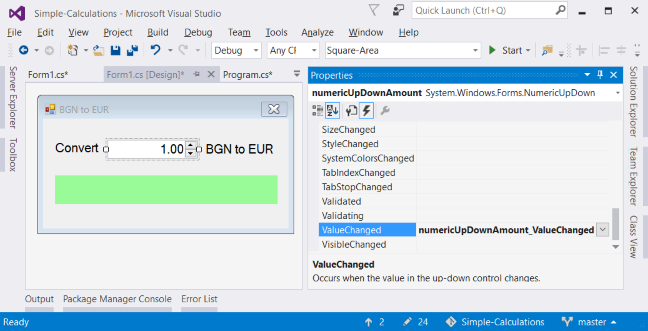

# GUI Application: Converter from BGN to EUR

We need to create **a graphical application** (GUI application) that calculates the value in **Euro** (EUR) of monetary amount given in **Bulgarian levs** (BGN). By changing the amount in BGN, the amount in EUR has to be recalculated automatically (we use a fixed rate BGN / EUR: **1.95583**).


This exercise goes beyond the material learned in this book and its purpose is not to teach you how to program GUI applications, but to strengthen your interest in software development. Let's get to work.

## Video: GUI Converter from BGN to EUR

Watch the following video lesson to learn how to build the Windows Forms based GUI application to convert BGN to EUR: https://youtu.be/xWbDjzLsu9U.

## Creating a New C# Project

We add to the existing Visual Studio solution one more project. This time we create a **Windows Forms** application with C# named "**BGN-to-EUR-Converter**":



## Adding UI Controls

We arrange the following UI (user interface) controls in the format:

* **`NumericUpDown`** with name **`numericUpDownAmount`** – it will enter the amount for conversion
* **`Label`** with name **`labelResult`** – it will show the result after conversion
* Two more **`Label`** components, serving only for static representation of a text

The graphical editor for user interface might look similar to this:



We do the following settings of the format and the separate controls:

|                                                                                     Setting                                                                                     |                                       Picture                                      |
| :-----------------------------------------------------------------------------------------------------------------------------------------------------------------------------: | :--------------------------------------------------------------------------------: |
| <p><strong><code>FormConverter</code></strong>:<br>Text = "BGN to EUR",<br>Font.Size = 12,<br>MaximizeBox = False,<br>MinimizeBox = False,<br>FormBorderStyle = FixedSingle</p> |  |
|            <p><strong><code>numericUpDownAmount</code></strong>:<br>Value = 1,<br>Minimum = 0,<br>Maximum = 10000000,<br>TextAlign = Right,<br>DecimalPlaces = 2</p>            |      |
|       <p><strong><code>labelResult</code></strong>:<br>AutoSize = False,<br>BackColor = PaleGreen,<br>TextAlign = MiddleCenter,<br>Font.Size = 14,<br>Font.Bold = True</p>      |    |

## Events and Event Handlers

We define the following **event handlers** in the controls:



After this we catch the following events:

* **`FormConverter.Load`** (by double-clicking with the mouse)
* **`numericUpDownAmount.ValueChanged`** (by double-clicking on **`NumericUpDown`** control)
* **`numericUpDownAmount.KeyUp`** (we choose **`Events`** from the dashboard **`Properties`** and double-click on **`KeyUp`**)

The event **`Form.Load`** is executed when the program is started, before the window of the application is shown. The event **`NumericUpDown.ValueChanged`** is executed when a change in the value inside the field for entering a number occurs. The event **`NumericUpDown.KeyUp`** is executed after pressing a key in the field that enters a number. On the occurrence of each of these events, we will recalculate the result.

To **catch an event**, we use the events icon (Events) in the \[**Properties**] window in Visual Studio:


## Writing the Program Code

We will use the following **C# code** for handling events:

```csharp
private void FormConverter_Load(object sender, EventArgs e)
{
  ConvertCurrency();
}

private void numericUpDownAmount_ValueChanged(object sender, EventArgs e)
{
  ConvertCurrency();
}

private void numericUpDownAmount_KeyUp(object sender, KeyEventArgs e)
{
  ConvertCurrency();
}
```

All of the caught events call the method **`ConvertCurrency()`**, which converts the given sum from BGN to EUR and shows the result in the green box. We have to write the **code** (program logic) the conversion:

```csharp
private void ConvertCurrency()
{
  var amountBGN = this.numericUpDownAmount.Value;
  var amountEUR = amountBGN * 1.95583m;
  this.labelResult.Text = 
    amountBGN + " BGN = " + 
    Math.Round(amountEUR, 2) + " EUR";
}
```

## Testing the Application

Finally, **we start the project** with \[**Ctrl+F5**] and test if it works correctly.

If you have any problems with the example above, you can ask for help in the SoftUni official **discussion forum** (https://www.reddit.com/r/softuni) or in the SoftUni official **Facebook page** (https://fb.com/softuni.org).
