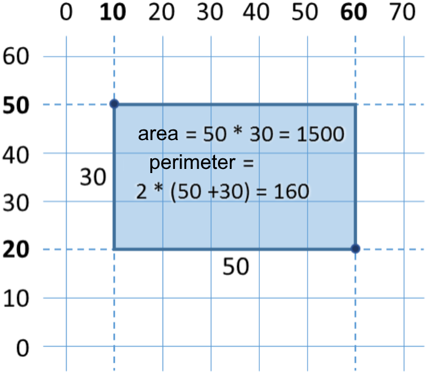
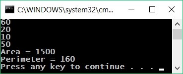

# Numerical Expressions

In programming, we can calculate **numerical expressions**, for example:

```csharp
var expr = (3 + 5) * (4 – 2);
```

The standard rule for priorities of arithmetic operations is applied: **multiplying and dividing are always done before adding and subtracting**. In case of an **expression in brackets, it is calculated first**, but we already know all of that from school math.

## Video: Numerical Expressions

Watch a video lesson about numerical expressions: [https://youtu.be/6MPxlOCsPdw](https://youtu.be/6MPxlOCsPdw).

## Example: Calculating Trapezoid Area

Let's write a program that inputs the lengths of the two bases of a trapezoid and its height (one floating point number per line) and calculates the **area of the trapezoid** by the standard math formula:

```csharp
var b1 = double.Parse(Console.ReadLine());
var b2 = double.Parse(Console.ReadLine());
var h = double.Parse(Console.ReadLine());
var area = (b1 + b2) * h / 2.0;
Console.WriteLine("Trapezoid area = " + area);
```

If we start the program and enter values for the sides: 3, 4 and 5, we will obtain the following result:

```
3
4
5
Trapezoid area = 17.5
```

### Testing in the Judge System

Test your solution here: [https://judge.softuni.org/Contests/Practice/Index/504#4](https://judge.softuni.org/Contests/Practice/Index/504#4).

## Example: Circle Area and Perimeter

Let's write a program that calculates **a circle area and perimeter** by reading its **radius r**.

Formulas:

* Area = π \* r \* r
* Perimeter = 2 \* π \* r
* π ≈ 3.14159265358979323846…

```csharp
Console.Write("Enter circle radius. r = ");
var r = double.Parse(Console.ReadLine());
Console.WriteLine("Area = " + Math.PI * r * r); 
// Math.PI – built-in constant for π in C#
Console.WriteLine("Perimeter = " + 2 * Math.PI * r);
```

Let's test the program with \*\*radius \*\*`r = 10`:


### Testing in the Judge System

Test your solution here:[https://judge.softuni.org/Contests/Practice/Index/504#5](https://judge.softuni.org/Contests/Practice/Index/504#5).

## Example: 2D Rectangle Area

A rectangle is given with the **coordinates of two of its opposite angles**. Calculate its **area and perimeter**:



In this task, we have to consider that if we subtract the smaller `x` from the bigger `x`, we will obtain the length of the rectangle. Identically, if we subtract the smaller `y` from the bigger `y`, we will obtain the height of the rectangle. What is left is to multiply both sides. Here is an example of an implementation of the described logic:

```csharp
var x1 = double.Parse(Console.ReadLine());
var y1 = double.Parse(Console.ReadLine());
var x2 = double.Parse(Console.ReadLine());
var y2 = double.Parse(Console.ReadLine());

// Calculating the sides of the rectangle:
var width = Math.Max(x1, x2) - Math.Min(x1, x2);
var height = Math.Max(y1, y2) - Math.Min(y1, y2);

Console.WriteLine("Area = " + width * height);
Console.WriteLine("Perimeter = " + 2 * (width + height));
```

We use `Math.Max(a, b)`, to find the higher value from `a` and `b` and identically `Math.Min(a, b)` to find the lower of both values.

When the program is executed with the values from the coordinate system given in the condition, we obtain the following result:



### Testing in the Judge System

Test your solution here:[https://judge.softuni.org/Contests/Practice/Index/504#6](https://judge.softuni.org/Contests/Practice/Index/504#6).

## Other Expressions

Expressions in C# can be not only numerical, but also can be text expressions, date expressions or expressions of other type:

```csharp
var price = 20;
var priceUSD = "$ " + price; // text expression
var priceGBP = price + " GBP";
Console.WriteLine(priceUSD); // $ 20
Console.WriteLine(priceGBP); // 20 GBP
var date = new DateTime(2017, 6, 14);
var dateAfter5days = date.AddDays(5); // 14-Jun-17 (date expression)
Console.WriteLine(dateAfter5days); // 19-Jun-17 00:00:00
```
