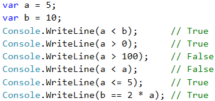
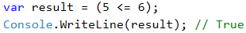

# Comparing Numbers

In programming, we can compare values using the following **operators**:

* Operator `<` (less than)
* Operator `>` (greater than)
* Operator `<=` (less than or equals)
* Operator `>=` (greater than or equals)
* Operator `==` (equals)
* Operator `!=` (different from)

When compared, the result is a Boolean value **true** or **false**, depending on whether the result of the comparison is true or false.

## Video: Comparing Numbers

Watch the video lesson about comparing numbers: https://youtu.be/KTdqDWg7Wf8.

## Examples for Comparing Numbers

Note that when printing the **true** and **false** values in C # language, they are printed with a capital letter, respectively **True** and **False**.

## Comparison Operators

In C#, we can use the following comparison operators:

| Operator               | Notation | Applicable for                           |
| ---------------------- | -------- | ---------------------------------------- |
| Equals                 | ==       | numbers, strings, dates                  |
| Not equal              | !=       |                                          |
| Greater than           | >        | numbers, dates, other comparable objects |
| Greater than or equals | >=       |                                          |
| Less than              | <        |                                          |
| Less than or equals    | <=       |                                          |

The following **example** demonstrates how to use comparison operators in expressions:

