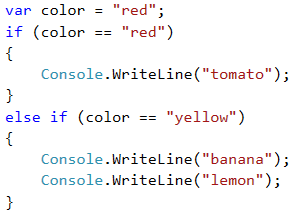

# Simple If-Else Conditions

In programming we often **check particular conditions** and perform various actions depending on the result of the check. This is done by **if** condition, which has the following structure:

```csharp
if (condition)
{
    // condition body;  
}
```

## Video: Simple If / If-Else Conditions

Watch the video lesson about the simple if-conditions: https://youtu.be/M-G4nOaVDVA.

## Example: Excellent Grade

We read the grade from the console and check if it's excellent (`≥ 5.50`).


Test the code from the example locally. Try entering different grades, for example **4.75**, **5.49**, **5.50** and **6.00**. For grades **less than 5.50**, the program will not give any output, however if the grade is **5.50 or greater**, the output would be "**Excellent!**".

### Testing in the Judge System

Test your solution from the example here:\
[https://judge.softuni.org/Contests/Practice/Index/506#0](https://judge.softuni.org/Contests/Practice/Index/506#0).

## If-Else Conditions

The **`if`** construction may also contain an **`else`** clause to give a specific action in case the Boolean expression (which is set at the beginning **`if (bool expression)`** ) returns a negative result (**`false`**). Built this way, **the conditional statement** is called **`if-else`** and its behavior is as follows: if the result of the condition is **positive** (**`true`**) – we perform some actions, when it is **negative** (**`false`**) – others. The format of the construction is:

```csharp
if (condition)
{
    // condition body;
}
else
{
    // else construction body;
}
```

## Example: Excellent Grade or Not

Like the example above, we read the grade from the console and check if it's excellent, but this time we should **output the result in both cases**.


### Testing in Judge System

Test your solution from the example here: [https://judge.softuni.org/Contests/Practice/Index/506#1](https://judge.softuni.org/Contests/Practice/Index/506#1).

## About the Curly Braces {} After If / Else

When we have **only one command** in the body of the \*\* if construction\*\*, we can **skip the curly brackets**, indicating the conditional operator body. When we want to execute **block of code** (group of commands), curly brackets are **required**. In case we drop them, **only the first line** after the **if clause** will be executed.

|  | It's a good practice to **always put curly braces,** because it makes our code more readable and cleaner. |
| ----------------------------------- | --------------------------------------------------------------------------------------------------------- |

Here is an example where dropping curly braces leads to confusion:


Executing the above code will output the following console result:


With curly braces:



The following output will be printed on the console:


