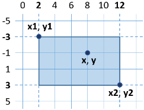
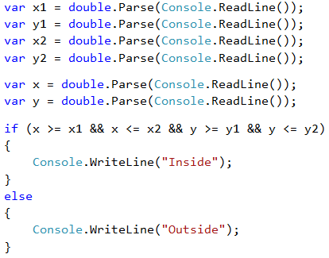

# Logical "AND"

As we saw, in some tasks we have to make **many checks at once**. But what happens when in order to execute some code **more** conditions have to be executed and we **don't want to** make a **negation** (**`else`**) for each one of them? The option with nested **`if` blocks** is valid, but the code would look very **unordered** and for sure – **hard** to read and maintain.

The logical "**AND**" (operator **`&&`**) means a few conditions have to be **fulfilled simultaneously**. The following table of truthfulness is applicable:

| a                                     | b                                     | a && b                                 |
| ------------------------------------- | ------------------------------------- | -------------------------------------- |
| <p>true<br>true<br>false<br>false</p> | <p>true<br>false<br>true<br>false</p> | <p>true<br>false<br>false<br>false</p> |

## Video: Logical "AND"

Watch this video to learn how to use logical "AND" in programming: https://youtu.be/V86\_z8GWarM.

## How the && Operator Works?

The **`&&`** operator accepts **a couple of Boolean** (conditional) statements, which have a **`true`** or **`false`** value, and returns **one** bool statement as a **result**. Using it **instead** of a couple of nested **`if`** blocks, makes the code **more readable**, **ordered** and **easy** to maintain. But how does it **work**, when we put a **few** conditions one after another? As we saw above, the logical **"AND"** returns **`true`**, **only** when it accepts as **arguments statements** with value **`true`**. Respectively, when we have a **sequence** of arguments, the logical "AND" **checks** either until one of the arguments is **over**, or until it **meets** an argument with value **`false`**.

**Example**:

```csharp
bool a = true;
bool b = true;
bool c = false;
bool d = true;
bool result = a && b && c && d;
// false (as d is not being checked)
```

The program will run in the **following** way: **It starts** the check form **`a`**, **reads** it and accepts that it has a **`true`** value, after which it **checks** **`b`**. After it has **accepted** that **`a`** and **`b`** return **`true`**, **it checks the next** argument. It gets to **`c`** and sees that the variable has a **`false`** value. After the program accepts that the argument **`c`** has a **`false`** value, it calculates the expression **before `c`**, **independent** of what the value of **`d`** is. That is why the evaluation of **`d`** is being **skipped** and the whole expression is calculated as **`false`**.


## Example: Point in a Rectangle

Checks whether **point {x, y}** is placed **inside the rectangle {x1, y1} – {x2, y2}**. The input data is read from the console and consists of 6 lines: the decimal numbers **x1**, **y1**, **x2**, **y2**, **x** and **y** (as it is guaranteed that **x1 < x2** and **y1 < y2**).

### Sample Input and Output

| Input                                | Output |                              Visualization                             |
| ------------------------------------ | ------ | :--------------------------------------------------------------------: |
| <p>2<br>-3<br>12<br>3<br>8<br>-1</p> | Inside |  |

### Solution

A point is internal for a given polygon, if the following four conditions are applied **at the same time**:

* The point is placed to the right from the left side of the rectangle.
* The point is placed to the left from the right side of the rectangle.
* The point is placed downwards from the upper side of the rectangle.
* The point is placed upwards from the down side of the rectangle.



### Testing in the Judge System

Test your solution here: [https://judge.softuni.org/Contests/Practice/Index/508#2](https://judge.softuni.org/Contests/Practice/Index/508#2).
