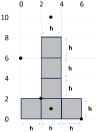
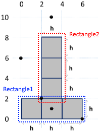
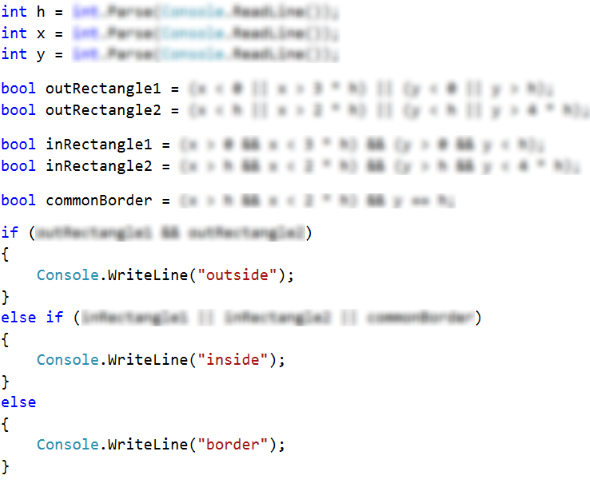

# Problem: \* Point in the Figure

The figure consists of **6 blocks with size h \* h**, placed as in the figure below. The lower left angle of the building is on position {0, 0}. The upper right angle of the figure is on position {**2\*h**, **4\*h**}. The coordinates given in the figure are for **h = 2**:

Write a program that enters an integer **h** and the coordinates of a given **point {x, y}** (integers) and prints whether the point is inside the figure (**inside**), outside of the figure (**outside**) or on any of the borders of the figure (**border**).

## Sample Input and Output

| Input               | Output  | Input              | Output |
| ------------------- | ------- | ------------------ | ------ |
| 
2 3 10
 | outside | 
2 3 1
 | inside |

| Input              | Output | Input              | Output |
| ------------------ | ------ | ------------------ | ------ |
| 
2 2 2
 | border | 
2 6 0
 | border |

| Input              | Output  | Input                 | Output  |
| ------------------ | ------- | --------------------- | ------- |
| 
2 0 6
 | outside | 
15 13 55
 | outside |

| Input                 | Output | Input                 | Output  |
| --------------------- | ------ | --------------------- | ------- |
| 
15 29 37
 | inside | 
15 37 18
 | outside |

| Input                | Output  | Input                | Output |
| -------------------- | ------- | -------------------- | ------ |
| 
15 -4 7
 | outside | 
15 30 0
 | border |

## Hints and Guidelines

A possible logic for solving the task (not the only correct one):

* We might split the figure into **two rectangles** with a common side:

* A point is **outer (outside)** for the figure, when it is **outside** both of the rectangles.
* A point is **inner (inside)** for the figure, if it is inside one of the rectangles (excluding their borders) or lies on their common side.
* In **other case** the point lies on the border of the rectangle (**border**).

## Implementation of the Proposed Idea

An exemplary implementation of the described idea (parts of the code are blurred with the purpose of stimulating logical thinking and solving skills):

## Testing in the Judge System

Test your solution here: [https://judge.softuni.org/Contests/Practice/Index/508#12](https://judge.softuni.org/Contests/Practice/Index/508#12).
