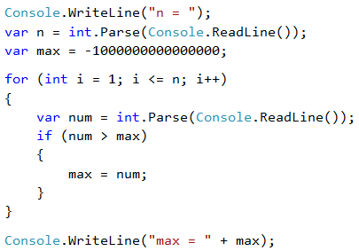

# Problem: Max Number

Write a program that enters **n integers** (**n** > 0) and finds **the max number** among them (the largest number). The first line of the input, specifies the number of integers **n**. The next **n** lines hold the integers, one per line. Examples:

## Sample Input and Output

| Input                                | Output |
| ------------------------------------ | ------ |
| 
2 100 99
                | 100    |
| 
3 -10 20 -30
         | 20     |
| 
4 45 -20 7 99 
 | 99     |
| 
1 999
                      | 999    |
| 
2 -1 -2
                 | -1     |

## Video: Largest Number

Watch this video lesson to learn how to find the largest number among a sequence of number: https://youtu.be/KErfOdOuezE.

## Hints and Guidelines

We will first enter one number **`n`** (the number of integers that are about to be entered). We assign the current maximum **`max`** an initial neutral value, for example **-10000000000000** (or **`int.MinValue`**). Using a **`for` loop** that is iterated **n-1 times**, we read one integer **`num`** on each iteration. If the read number **`num`** is higher than the current maximum **`max`**, we assign the value of the **`num`** to the **`max`** variable. Finally, in **`max`** we must have stored the highest number. We print the number on the console.

## Testing in the Judge System

Test your solution here: [https://judge.softuni.org/Contests/Practice/Index/510#4](https://judge.softuni.org/Contests/Practice/Index/510#4).
