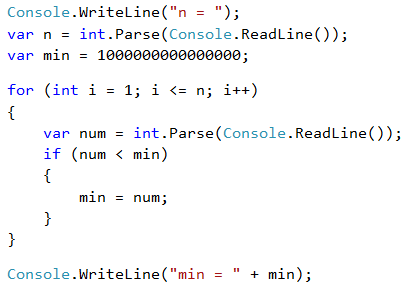

# Problem: Min Number

Write a program that inputs **n integers** (**n** > 0) and finds **the min** number among them (the smallest number). First enter the number of integers **n**, then **n** numbers additionally, one per line.

## Sample Input and Output

| Input                                | Output |
| ------------------------------------ | ------ |
| 
2 100 99
                | 99     |
| 
3 -10 20 -30
         | -30    |
| 
4 45 -20 7 99 
 | -20    |

## Video: Smallest Number

Watch this video lesson to learn how to find the smallest number among a sequence of number: https://youtu.be/IHuz-mXbhzg.

## Hints and Guidelines

The problem is completely identical to the previous one, except this time we will start with another neutral starting value.

## Testing in the Judge System

Test your solution here: [https://judge.softuni.org/Contests/Practice/Index/510#5](https://judge.softuni.org/Contests/Practice/Index/510#5).
