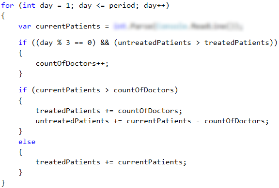

# Problem: Hospital

For a certain period of time, patients arrive at the hospital every day for an examination. It has **initially 7 doctors**. Each doctor can treat only **one patient per day**, but sometimes there is a shortage of doctors, so the **remaining patients are sent to other hospitals**. **Every third day** the hospital makes calculations and **if the count of untreated patients is greater than the count of treated ones, another doctor is appointed**. Appointment takes place before the daily patient acceptance begins.

Write a program, that calculates **for a given period of time, the count of treated and untreated patients**.

## Input Data

Input is read from the **console** and contains:

* On the first line – **the period**, for which you need to make calculations. **Integer** in the range of \[**1 … 1000**].
* On the next lines (equal to the count of days) – **count of the patients**, who arrive for treatment for the **current day**. Integer in the range of \[**0 … 10 000**].

## Output Data

Print **on the console 2 lines**:

* On the **first line**: “**Treated patients: {count of treated patients}.**”
* On the **second line**: “**Untreated patients: {count of untreated patients}.**”

## Sample Input and Output

| **Input**                     | **Output**                                              | **Comments**                                                                                                                                                                                                                                                                                                                                                                                                                                                                           |
| ----------------------------- | ------------------------------------------------------- | -------------------------------------------------------------------------------------------------------------------------------------------------------------------------------------------------------------------------------------------------------------------------------------------------------------------------------------------------------------------------------------------------------------------------------------------------------------------------------------- |
| 
4 7 27 9 1
 | 
Treated patients: 23. Untreated patients: 21.
 | 
<strong>Day 1</strong>: 7 treated and 0 untreated patients for the day <strong>Day 2</strong>: 7 treated and 20 untreated patients for the day <strong>Day 3</strong>: By this moment the treated patients are 14, and untreated ones – 20 –> New doctor is appointed. –> 8 treated and 1 untreated patients for the day <strong>Day 4</strong>: 1 treated and 0 untreated patients for the day <strong>Total: 23 treated and 21 untreated patients.</strong>
 |

| **Input**                                   | **Output**                                              |
| ------------------------------------------- | ------------------------------------------------------- |
| 
6 25 25 25 25 25 2
 | 
Treated patients: 40. Untreated patients: 87.
 |
| 
3 7 7 7
                     | 
Treated patients: 21. Untreated patients: 0.
  |

## Hints and Guidelines

Let’s solve the problem step by step: read the input data, calculate the number treated and untreated patients and print the output.

### Reading the Input Data

Again, we begin by **declaring and initializing** the required variables:

The period in which we have to make the calculations is read from the console and saved in the **`period`** variable. We will also need some helper variables: the number of treated patients (**`treatedPatients`**), the number of untreated patients (**`untreatedPatients`**) and the number of doctors (**`countOfDoctors`**), which is initially 7.

### Calculating the Number of Treated and Untreated Patients

With the help of a **`for` loop** we iterate through all days in the given period (**`period`**). For each day, we read from the console the number of the patients (**`currentPatients`**). Increasing doctors by requirements can be done **every third day**, **BUT** only if the count of untreated patients is **greater** than the count of treated ones. For this purpose, we check if the day is third one – with the arithmetical operator for division with remainder (**`%`**): **`day % 3 == 0`**.

For example:

* If the day is **third one**, the remainder of the division by **3** will be **0** (**`3 % 3 = 0`**) and the check **`day % 3 == 0`** will return **`true`**.
* If the day is **second one**, the remainder of the division by **3** will be **2** (**`2 % 3 = 2`**) and the check will return **`false`**.
* If the day is **forth one**, the remainder of the division will be **1** (**`4 % 3 = 1`**) and the check will return again **`false`**.

If **`day % 3 == 0`** returns **`true`**, the system will check whether the count of untreated patients is greater than the count of treated ones: **`untreatedPatients > treatedPatients`**. If the result is again **`true`**, then the count of doctors will be increased (**`countOfDoctors`**).

Then we check if the count of the patients for the day (**`currentPatients`**) is greater than the count of doctors (**`countOfDoctors`**). If the count of the patients is **greater**:

* Increase the value of the variable **`treatedPatients`** by the count of doctors (**`countOfDoctors`**).
* Increase the value of the variable **`untreatеdPatients`** by the count of the remaining patients, which we calculate by subtracting the count of doctors from the count of patients (**`currentPatients - countOfDoctors`**).

If the count of patients **is not greater**, increase only the variable **`treatedPatients`** with the count of patients for the day (**`currentPatients`**).

Finally, we need to print the count of treated and count of untreated patients.

## Testing in the Judge System

Test your solution here: [https://judge.softuni.org/Contests/Practice/Index/511#3](https://judge.softuni.org/Contests/Practice/Index/511#3).
