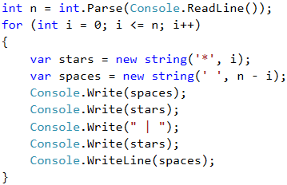

# Problem: Christmas Tree

Write a program that takes a number **n** (1 ≤ n ≤ 100) and prints a Christmas tree with height of **n+1**.

| Input | Output                                          | Input | Output                                                                      |
| ----- | ----------------------------------------------- | ----- | --------------------------------------------------------------------------- |
| 1     | 
  <code>|</code>   <code>* | *</code>
 | 2     | 
   <code>|</code>     <code>* | *</code>  <code>** | **</code>
 |

| Input | Output                                                                                                      | Input | Output                                                                                                                                          |
| ----- | ----------------------------------------------------------------------------------------------------------- | ----- | ----------------------------------------------------------------------------------------------------------------------------------------------- |
| 3     | 
    <code>|</code>       <code>* | *</code>    <code>** | **</code>  <code>*** | ***</code>
 | 4     | 
     <code>|</code>         <code>* | *</code>      <code>** | **</code>    <code>*** | ***</code>  <code>**** | ****</code>
 |

## Video: Christmas Tree

Watch this video lesson to learn how to print a Christmas tree on the console using nested loops: https://youtu.be/UecoBfhUIkk.

## Hints and Guidelines

From the examples we see that **the Christmas tree** can be **divided** into **three** logical parts. **The first** part is **the stars and the white spaces before and after them**, **the middle** part is **`|`**, and **the last** part is again **stars**, but this time there are **white spaces** only **before** them. The printing can be done with only **one loop** and the **`new string(…)`** constructor, which we will use once for the stars and once for the white spaces.

## Testing in the Judge System

Test your solution here: [https://judge.softuni.org/Contests/Practice/Index/512#6](https://judge.softuni.org/Contests/Practice/Index/512#6).
