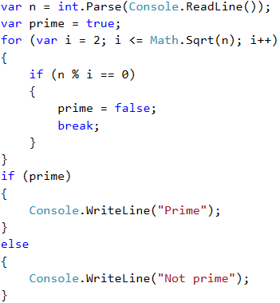

# Example: Prime Number Checking

The next problem we are going to solve is to **check whether given number is prime**. An integer is prime if it cannot be decomposed to a product of other numbers. For example: 2, 5 and 19 are primes, while 9, 12 and 35 are composite.

## Video: Prime Number Checking

Watch this video lesson to learn how to check if a number is prime: https://youtu.be/4lWOaPWKf0I.

## Hints and Guidelines

Before proceeding to the hints about solving the "prime checking" problem, let's recall in bigger detail what **prime numbers** are.

**Definition**: an integer is **prime** if it is **divisible only by itself and by 1**. By definition, the prime numbers are positive and greater than 1. The smallest prime number is 2.

We can assume that an integer **n** is a prime number if **n > 1** and **n** is not divisible by a number between **2** and **n-1**.

The first few prime numbers are: 2, 3, 5, 7, 11, 13, 17, 19, 23, 29, 31, 37, 41, 43, …

Unlike the prime numbers, **composite numbers** are integers which can be obtained by multiplying several prime numbers.

Here are some examples of **composite numbers**:

* **10** = 2 \* 5
* **42** = 2 \* 3 \* 7
* **143** = 13 \* 11

Positive integers, greater than 1, can be either **prime** or **composite** (product of primes). Numbers like **0** and **1** are not prime, but are also not composite.

We can **check if an integer is prime** following the definition: check if **n > 1** and **n** is divisible by **2**, **3**, …, **n-1** without reminder.

* If it is divisible by any of the numbers, it is **composite**.
* If it is not divisible by any of the numbers, then it is **prime**.

|  | We can optimize the algorithm instead of checking it to **`n-1`**, to check divisors to **`√n`**. Think what the reason for that is! |
| -------------------------------------- | ------------------------------------------------------------------------------------------------------------------------------------ |

## Prime Checking Algorithm

The most popular **algorithm** to check if a number **n** is prime is by checking if **n** is divisible by the numbers between 2 and √n.

The **steps** of the "prime checking algorithm" are given below in bigger detail:

* We create the variable **`n`** to which we assign an integer taken from the console input.
* We create an **`isPrime`** bool variable with an initial value **`true`**. We assume that a number is prime until proven otherwise.
* We create a **`for`** loop in which we set an initial value 2 for the loop variable, for condition **the current value `<= √n`**. The loop step is 1.
* In **the body of the loop**, we check if **`n`**, divided by **the current value**, has a remainder. If there is **no reminder** from the division, then we change **`isPrime`** to **`false`** and we exit the loop through the **`break`** operator.
* Depending on the value of **`isPrime`**, we print whether the number is prime (**`true`**) or composite (**`false`**).

## Implementation of the Prime Checking Algorithm

Here is a **sample implementation** of the prime checking algorithm, described above:

What remains is to add a **condition that checks if the input number is greater than 1**, because by definition numbers such as 0, 1, -1 and -2 are not prime.

## Testing in the Judge System

Test your solution here: [https://judge.softuni.org/Contests/Practice/Index/514#9](https://judge.softuni.org/Contests/Practice/Index/514#9).
