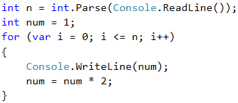

# Example: Numbers 1...2^n

In the following example, we will look at using the usual step with size of 1, combined with a calculation at each loop iteration.

Write a program that prints the numbers from **1 to 2^n** (two in power of n). For example, **if n = 10**, the result will be: **1, 2, 4, 8, 16, 32, 64, 128, 256, 512, 1024**.

## Video: Numbers 1 ... 2^n

Watch this video lesson to learn how to iterate over the number from 1 to 2^n using a for-loop: [https://youtu.be/B2k\_yx3EV0I](https://youtu.be/B2k\_yx3EV0I).

## Hints and Guidelines

The code below demonstrates how we can **calculate the powers of 2** for given **n** using a for-loop with a calculation at the end of its body:

## Testing in the Judge System

Test your solution here: [https://judge.softuni.org/Contests/Practice/Index/514#2](https://judge.softuni.org/Contests/Practice/Index/514#2).
