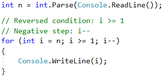

# Example: Numbers N...1

Write a program that prints the numbers from **n to 1 in reverse order** (step of -1). For example, **if n = 100**, the result will be: **100, 99, 98, …, 3, 2, 1**.

## Video: Numbers N...1

Watch this video lesson to learn how to print the numbers from N down to 1 (in reverse order) using a for loop: [https://youtu.be/LGPZ-ug3qh0](https://youtu.be/LGPZ-ug3qh0).

## Hints and Guidelines

We can solve the problem in the following way:

* We read the number `n` from the console input.
* We create a `for`\*\* loop\*\* by assigning `int i = n`.
* We reverse the condition of the loop: `i >= 1`.
* We define the size of the step: **-1**.
* In **the body of the loop**, we print the value of the current step.

## Testing in the Judge System

Test your solution here: [https://judge.softuni.org/Contests/Practice/Index/514#1](https://judge.softuni.org/Contests/Practice/Index/514#1).
