# Lab: Web Application with Complex Loops

Now we know how to repeat a group of actions using **loops**. Let's do something interesting: **a web-based game**. Yes, a real game, with graphics and game logic. Let's have fun. It will be complicated, but if you do not understand how it works, there is no problem. We are now entering into programming. You will advance with coding and with the software technologies over the time. For now, just follow the steps.

## Problem: Web Application "Fruits Game"

**Description**: Develop an **ASP.NET MVC Web Application** – a game in which the player **shoots fruits**, arranged in a table. Successfully hit fruits disappear and the player gets points for each target fruit. When you hit a **dynamite**, the fruits explode and the game ends (as in Fruit Ninja).

### Video: Fruits Game – ASP.NET MVC Web App

Watch this video lesson to learn how to build an ASP.NET MVC Web application "Fruits Game": https://youtu.be/inCr6SpHWC0.

### Fruits Game Explained

Shooting is done by columns, top to bottom or bottom to top, and the location of impact (the column under fire) is set by a scroll bar. Because of the inaccuracy of the scroller, the player is not quite sure which column they are going to shoot. Thus, every shot has a chance not to hit and this makes the game more interesting (like the sling in Angry Birds).

Our game should look like this:

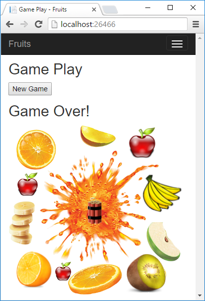

## Create New C# Project

In Visual Studio, we create a new **ASP.NET MVC web application** with C# language. Add a new project from \[**File**] → \[**New**] → \[**Project…**]. We give it a meaningful name, for example "**Fruits-Web-Game**":

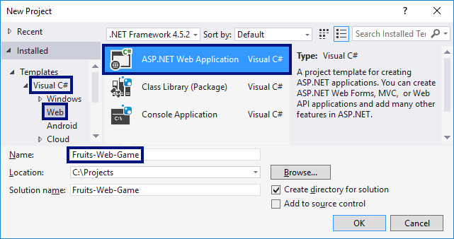

Then we choose the type of web app "MVC":

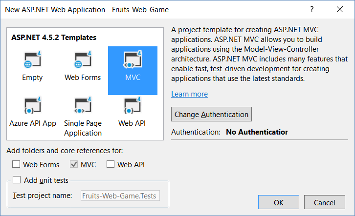

## Create Controls

Now we will create the controls for the game. The goal is to add **scrolling bars** by which the player is targeting, and a button for starting a **new game**. We need to edit the file `Views/Home/Index.cshtml`. We delete everything in it and write the code from the picture:

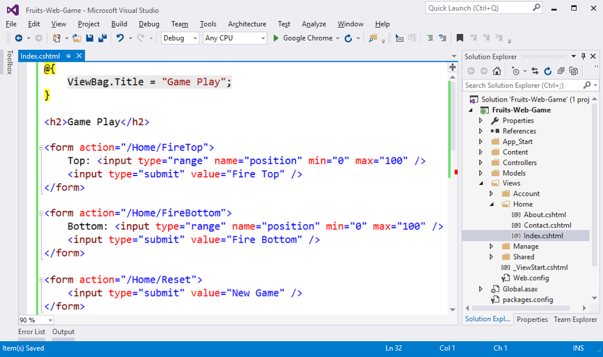

This code creates an HTML form `<form>` with a scroller `position` for setting a number in the range \[**0 … 100**] and a button \[**Fire Top**] for sending the form data to the server. The action that will process the data is called `Home/FireTop`, which means `FireTop` method in the `Home` controller, which is located in the file `HomeController.cs`. There are two similar forms with the \[**Fire Bottom**] and \[**New Game**] buttons.

## Prepare Fruits for the View

Now we have to prepare the fruits for drawing in the view. Add the following code to the controller: `Controllers/HomeController.cs`:

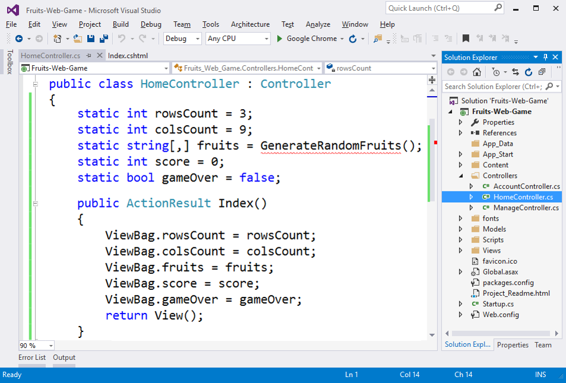

The above code defines the fields for **number of rows, number of columns**, **fruit table** (playing field), **points** accumulated by the player and information whether the game is active or **ended** (field `gameOver`). The playing field has 9 columns in 3 rows and contains for each field a text stating what is inside it: `apple`\*\*, **`banana`**, **`orange`**, **`kiwi`**, **`empty`** or \*\*`dynamite`.\
The main action `Index ()` prepares the game field by recording in the `ViewBag` the structure of the game elements and invoking the view that draws them into the game page of the web browser as HTML.

## Generate Random Fruits

We need to generate random fruits. To do this, we need to write a `GenerateRandomFruits()` method with the code from the image below. This code records in the matrix `fruits` names of different images and thus builds the playing field. Each cell of the table records one of the following values: `apple`\*\*, **`banana`**, **`orange`**, **`kiwi`**, **`empty`** or \*\*`dynamite`. Next, to draw the corresponding image in the view, the text of the table will be joined with the suffix “`.png`” and this will give the name of the picture file that has to be inserted into the HTML page as part of the playing field. Filling in the playing field (9 columns with 3 rows) happens in the view `Index.cshtml` with two nested `for` loops (for row and column).

In order to generate random fruit for each cell, a **random number** is generated between 0 and 8 (see the class `Random` in .NET). If the number is 0 or 1, we place `apple`, if it is between 2 and 3, we place `banana` and so on. If the number is 8, we place `dynamite`. Obviously, the fruits appear twice as often as the dynamite. Here's the code:

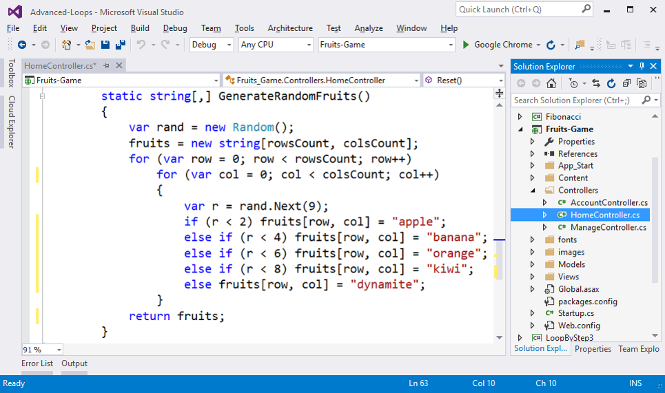

## Add Game Images

The next thing is to **add the images** for the game.

From \[**Solution Explorer**] create folder **images** in the root directory of the project. We use the menu \[**Add**] → \[**New Folder**].

Now we add the **game images** (they are part of the project files for this project and can be downloaded [here](https://github.com/SoftUni/Programming-Basics-Book-CSharp-EN/tree/master/assets/chapter-7-assets)). We copy them from Windows Explorer and put them in the **images** folder in \[**Solution Explorer**] in Visual Studio with **copy/paste**.

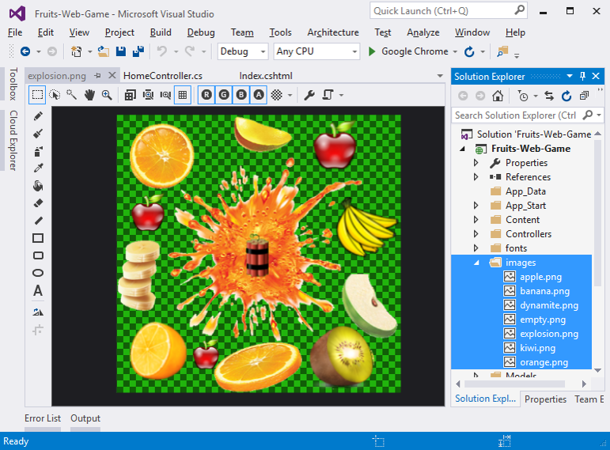

## Visualize Fruits

Drawing Fruits in `Index.cshtml`:

In order to **draw the playing field** with the fruits, we need to rotate **two nested loops** (for rows and columns). Each row consists of 9 images, each of which contains an `apple`, `banana` or other fruit, or empty `empty`, or `dynamite`. Images are drawn by printing an HTML tag to insert a picture: ``. Nine pictures are stacked one after the other on each row, followed by a new line with a ` `. This is repeated three times for the three lines. Finally, the player's points are printed. Here is what **the code** for drawing the playing field and points looks like:

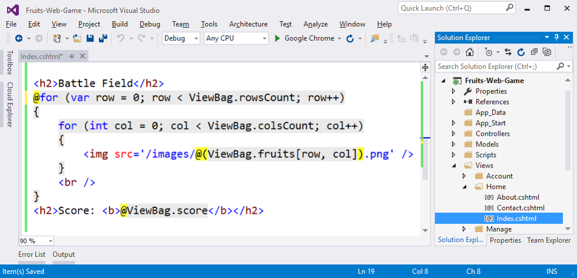

Take a look at the yellow characters `@` – they are used to switch between the **C#** and **HTML** languages and come from the **Razor** syntax for drawing dynamic web pages.

## Change Text in Layout

We need to adjust the texts in the `/Views/Shared/_Layout.cshtml` file. We replace `My ASP.NET Application` with more appropriate text, e.g. `Fruits`:

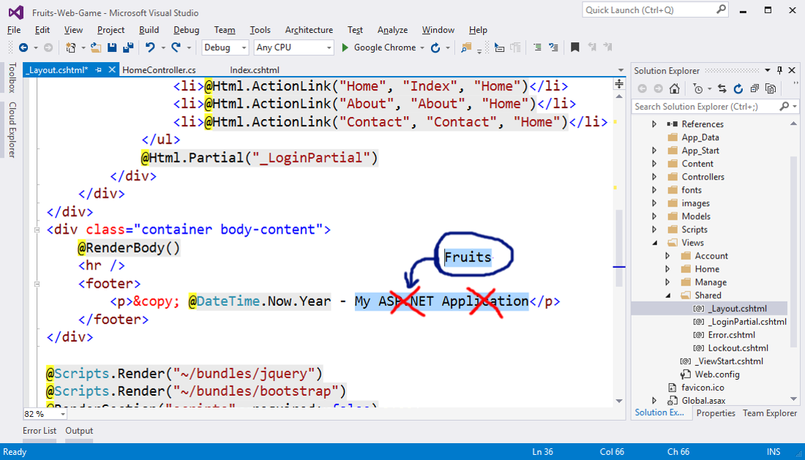

## Test the Application

Start the project using \[**Ctrl + F5**] and enjoy it. It is expected to generate a random 9-to-3 playing field with fruits and visualize it on the web page through a series of pictures:

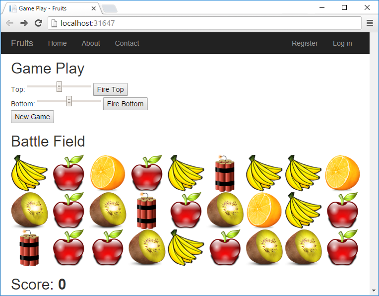

Now the game is sort of done: the playing field is randomly generated and rendered successfully (if you have not made a mistake somewhere). What remains is to fulfill the essence of the game: **shooting the fruits**.

## Shooting the Fruits

For the fruit shooting, we need to add the actions \[**Reset**] and \[**Fire Top**] / \[**Fire Bottom**] to the controller `HomeController.cs`:

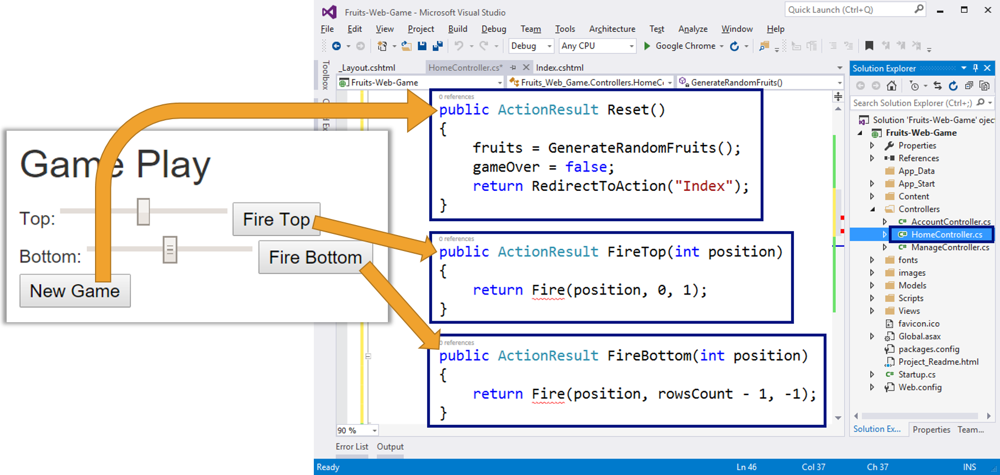

The above code defines three actions:

* `Reset()` – starts a new game by generating a new random playing field with fruits and explosives, resetting the player's points and making the game valid **(**`gameOver = false`**)**. This action is pretty simple and can be immediately tested using \[**Ctrl + F5**] before writing the other ones.
* `FireTop (position)` – shoots on row **0** at position `position` (number 0 to 100). The shooting is in direction **down** (+1) from row `0` (top). Shooting itself is more complicated as a logic and will be considered after a while.
* `FireBottom (position)` – shoots on row **2** at position `position` (number 0 to 100). The shooting is in direction **up** (-1) from row **2** (bottom).

## Implement the "Fire" Method

We implement the "firing" method `Fire (position, startRow, step)`:

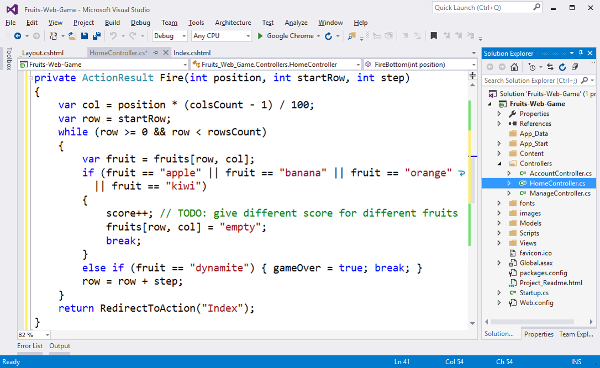

Shooting works like this: first calculate the column number `col` to which the player has targeted. The input number from the scroll bar (between 0 and 100) is reduced to a number between 0 and 8 (for each of the 9 columns). Line number `row` is either 0 (if the shot is on top) or the number of lines minus one (if the shot is below). Accordingly, the shooting direction (step) is **1** (down) or **- 1** (upwards).

In order to find where the shot hits fruit or dynamite, go through a loop through all the cells in the playing field in the target column and from the first to the last attack row. If a fruit is hit, it disappears (replaced by `empty`) and points are given to the player. If the `dynamite` is hit, the game is marked as finished.

The more enthusiastic among you can implement a more complex behavior, for example, to give different points in the pursuit of a different fruit, to carry out animation with an explosion (this is not too easy), to take points in unnecessary firing in an empty column and so on.

## Test the Application Again

**We are testing** what created up until now by starting with \[**Ctrl + F5**]:

* **New Game** → the new game button must generate a new playing field with randomly placed fruits and explosives and reset the player's points.
* **Shooting from top** → the top firing must remove the top fruit in the hit column or cause the game to end if there is dynamite. In fact, at the end of the game nothing is going to happen, because in the view this case is still not considered.
* **Shooting from bottom** → the shooting from bottom should remove the lowest fruit in the hit column or end the game when you hit the dynamite.

## Implement "Game Over"

For now, at **"End of the game"** nothing happens. If a player reaches a dynamite, the controller says that the game is over **(**`gameOver = true`**)**, but this fact is not visualized in any way. In order for the game to finish, we need to add several checks in the view:

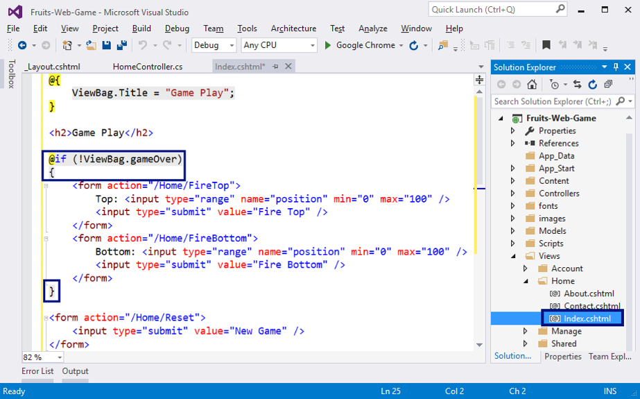

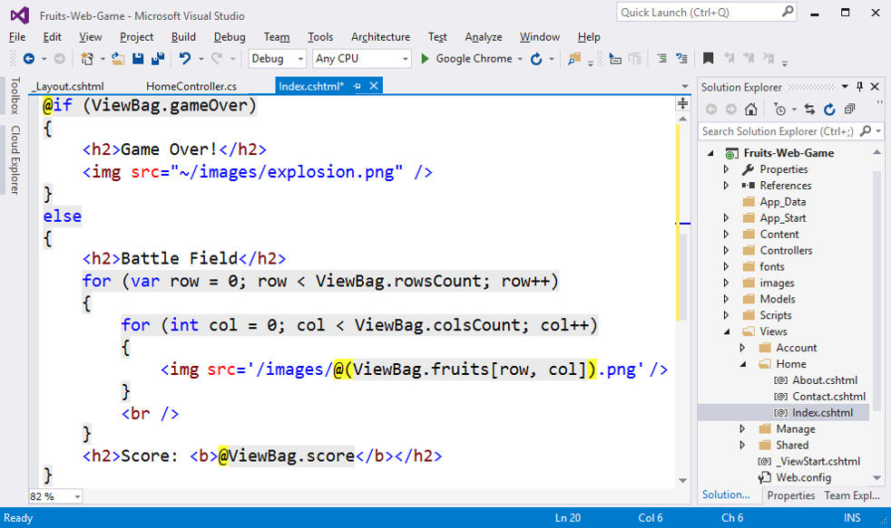

The code above checks whether the game has finished and indicates accordingly the shooting controls and the playing field (active game) or exploding fruit picture at the end of the game.

## Final Testing of the Application

After changing the code in the view, let's start by \[**Ctrl + F5**] and **test** the game again:

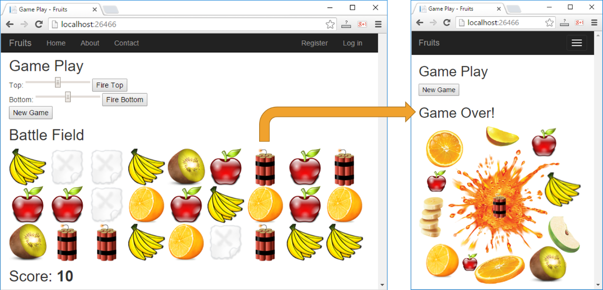

This time, when you hit a dynamite, the right picture should appear and allow only the "new game" action (the \[**New Game**] button).

Was it complicated? Did you manage to create the game? If you have not succeeded, relax, this is a relatively complex project that includes a great deal of non-studied matter. If you want the Web game to pass through your hands, follow the above steps. You can ask for specific issues in the SoftUni official **discussion forum** (https://www.reddit.com/r/softuni) or in the SoftUni official **Facebook page** (https://fb.com/softuni.org).
