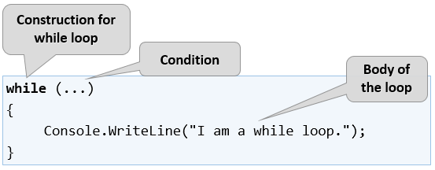
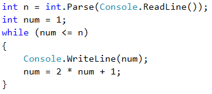

# While Loop

The next type of loops that we will get familiar with are called `while`\*\* loops\*\*. The specific thing about them is that they repeat a block of commands **while a condition is true**. As a structure, they differ from `for` loops, and even have a simple syntax.

## Video: While Loop

Watch this video lesson to learn how to use the while-loop in C#: [https://youtu.be/Jqnxl6k1V9w](https://youtu.be/Jqnxl6k1V9w).

## While Loop – Explanation

In programming **the `while` loop** is used when we want to **repeat** the execution of a certain logic while **a condition is in effect**. By "**condition**," we understand every **expression** that returns `true` or `false`. When **the condition** is **wrong**, **the `while` loop** is **interrupted**, the program **continues** to execute the remaining code after the loop. **The `while` loop** construction looks like this:

Here is a series of sample problems, the solution of which will help us better understand the use of the `while` loop.

## Example: Sequence of Numbers 2k+1

Write a program that prints all **numbers ≤ n** of the series: **1, 3, 7, 15, 31, …**, assuming that each next number = **previous number \* 2 + 1**.

Here is how we can solve the problem:

* We create a `num` variable for the current number to which we assign an initial **value of 1**.
* For a loop condition, we put **the current number <= n**.
* In **the body of the loop**: we print the value of the current number and increase the current number by using the formula from the problem's description.

Here is a sample implementation of this idea:

### Testing in the Judge System

Test your solution here: [https://judge.softuni.org/Contests/Practice/Index/514#4](https://judge.softuni.org/Contests/Practice/Index/514#4).
