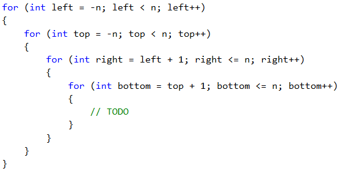
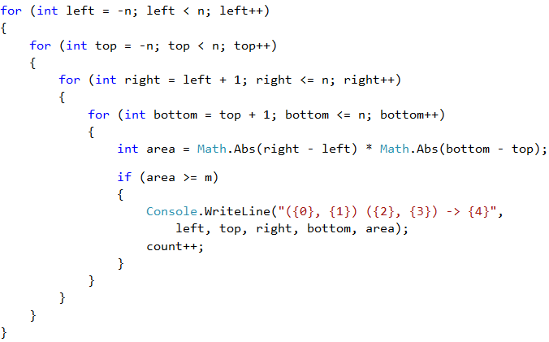

# Problem: Generating Rectangles

The next sample exam problem is about using nested loops and program logic to generate all possible rectangles, which have integer coordinates in given range and given minimum area.

## Video: Generating Rectangles

Watch the video lesson about solving the "Generating Rectangles" problem: https://youtu.be/gk1IOpMXpCc.

## Problem Description

By a given number **n** and **a minimum area m**, generate all possible rectangles with integer coordinates in the range \[**-n…n**] with an area of at least **m**. The generated rectangles must be printed in the following format:

* **(left, top) (right, bottom) -> area**

Rectangles are defined using the top left and bottom right corner. The following inequalities are in effect:

* **-n ≤ left < right ≤ n**
* **-n ≤ top < bottom ≤ n**

## Input

Two numbers, one per line, are entered from the console:

* An integer **n** in the range \[**1 … 100**] – sets the minimum and maximum coordinates of a peak.
* An integer **m** in the range \[**0 … 50 000**] – sets the minimum area of the generated rectangles.

## Output

* The described rectangles should be printed on the console in a format such as in the examples below.
* If there are no rectangles for the specified **n** and **m**, then print "**No**".
* The order of rectangles in the output is not important, so use and order of your choice.

## Sample Input and Output

| Input         | Output                                                                                                                    | Input          | Output |
| ------------- | ------------------------------------------------------------------------------------------------------------------------- | -------------- | ------ |
| 
1 2
 | 
(-1, -1) (0, 1) -> 2 (-1, -1) (1, 0) -> 2 (-1, -1) (1, 1) -> 4 (-1, 0) (1, 1) -> 2 (0, -1) (1, 1) -> 2
 | 
2 17
 | No     |

| Input          | Output                |
| -------------- | --------------------- |
| 
3 36
 | (-3, -3) (3, 3) -> 36 |

## Reading the Input Data

Read the input data from the console. We will also create a **counter**, which will store the number of rectangles found.

## Sample Idea for the Solution

It is very important to be able to imagine the problem before we begin to solve it. In our case it is required to search for rectangles in a coordinate system. The thing we know is that the **left point** will always have the coordinate **`x`, smaller** than **the right** one. Accordingly, **the upper one** will always have a smaller **`y`** coordinate than **the lower one**. To find all the rectangles, we'll have to create **a loop** similar to the previous problem, but this time, **not every next loop** will start from **the next number** because some of **the coordinates** can be equal (for example **`left`** and **`top`**).

With the variables **`left`** and **`right`** we will follow the coordinates **horizontally** and with **`top`** and **`bottom`** – **vertically**.

## Calculating the Rectangle Area and Printing the Output

The important thing here is knowing the corresponding coordinates so we can correctly calculate the sides of the rectangle. Now we have to find **the area of the rectangle** and check if it is **greater than** or **equal** to **`m`**. One **side** will be **the difference between `left` and `right`** and **the other one – between `top` and `bottom`**. Since the coordinates may be eventually interchanged, we will use **absolute values**. Again, we add **the counter** in the loop, counting **only the rectangles** we write. It is important to note that the writing order is **`left`**, **`top`**, **`right`**, **`bottom`**, as it is set in the problem's description.

Finally, we print "**No**" if there are no such rectangles.

## Testing in the Judge System

Test your solution here: [https://judge.softuni.org/Contests/Practice/Index/516#11](https://judge.softuni.org/Contests/Practice/Index/516#11).
