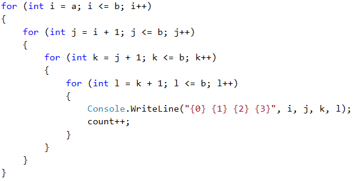

# Problem: Increasing 4 Numbers

The next sample exam problem is about using nested loops and program logic to generate all possible combinations of 4 increasing numbers in given range.

## Video: Increasing 4 Numbers

Watch the video lesson about solving the "Increasing 4 Numbers" problem: https://youtu.be/2DuNHqmbP5Y.

## Problem Description

For given pair of numbers **a** and **b** generate all four number **n1, n2, n3, n4,** for which **a ≤ n1 < n2 < n3 < n4 ≤ b**.

In combinatorics such a selection of subset from given set (or range) is called "[**combination**](https://en.wikipedia.org/wiki/Combination)", so the problem is essence is to **generate all combinations of 4 elements from given range of integers**.

## Input

The input contains two integers **a** and **b** in the range \[**0 … 1000**], one per line.

## Output

The output contains all **numbers in batches of four**, in ascending order, one per line.

## Sample Input and Output

| Input         | Output                                                     | Input           | Output                                                                                                                                                                                                                                   |
| ------------- | ---------------------------------------------------------- | --------------- | ---------------------------------------------------------------------------------------------------------------------------------------------------------------------------------------------------------------------------------------- |
| 
3 7
 | 
3 4 5 6 3 4 5 7 3 4 6 7 3 5 6 7 4 5 6 7
 | 
15 20
 | 
15 16 17 18 15 16 17 19 15 16 17 20 15 16 18 19 15 16 18 20 15 16 19 20 15 17 18 19 15 17 18 20 15 17 19 20 15 18 19 20 16 17 18 19 16 17 18 20 16 17 19 20 16 18 19 20 17 18 19 20 
 |

| Input         | Output | Input           | Output      |
| ------------- | ------ | --------------- | ----------- |
| 
5 7
 | No     | 
10 13
 | 10 11 12 13 |

## Reading the Input Data

We will read the input data from the console. We also create the additional variable **`count`**, which will keep track of **existing number ranges**.

## Implementation with 2 Numbers

We will most easily solve the problem if we logically divide it **in parts**. If we are required to draw all the rows from a number between **`a`** and **`b`**, we will do it using **one loop** that takes all the numbers from **`a`** to **`b`**. Let's think how to do this with **series of two numbers**. The answer is easy – we will use **nested loops**.

We can test the incomplete program to see if it's accurate so far. It must print all pairs of numbers **`i`**, **`j`** for which **`i ≤ j`**.

Since each **next number** of the row must be **greater** than **the previous one**, the second loop will run around **`i + 1`** (the next greater number). Accordingly, if **there is no sequence** of two incremental numbers (**`a`** and **`b`** are equal), the second loop **will not be fulfilled**, and nothing will be printed on the console.

## Implementation with 4 Numbers

**Similarly**, what remains is to implement **the nested loops** for **four numbers**. We will add an **increase of the counter** that we initialized in order to know if **there is such a sequence**.

Finally, we will check if **the counter** is equal to **0** and we will print "**No**" on the console accordingly, if so.

## Testing in the Judge System

Test your solution here: [https://judge.softuni.org/Contests/Practice/Index/516#10](https://judge.softuni.org/Contests/Practice/Index/516#10).
