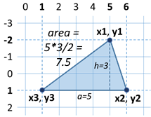
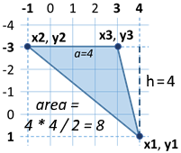
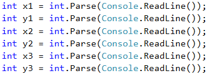
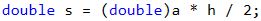
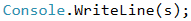

# Problem: Triangle Area

The first sample exam problem is about calculating the area of given triangle, specified by its coordinates (where the triangle stays horizontally).

## Video: Triangle Area

Watch the video lesson about solving the triangle area problem: https://youtu.be/m2O8\_rcNHtA.

## Problem Description

| Triangle in the plane is defined by the coordinates of its three vertices. First the vertex (x1, y1) is set. Then the other two vertices are set: (x2, y2) and (x3, y3), which lie on a common horizontal line (i.e. they have the same Y coordinates). Write a program that calculates the area of the triangle by the coordinates of its three vertices. |  |
| ---------------------------------------------------------------------------------------------------------------------------------------------------------------------------------------------------------------------------------------------------------------------------------------------------------------------------------------------------------- | ------------------------------------------------------------------ |

## Input

The console provides **6 integers** (one per line): **x1, y1, x2, y2, x3, y3.**

* All input numbers are in range \[**-1000 … 1000**].
* It is guaranteed that **y2 = y3**.

## Output

Print on the console **the area of the triangle**.

## Sample Input and Output

| Input                              | Output | Visualization                                                      | Comments                                                                                                                                                                                                                                            |
| ---------------------------------- | ------ | ------------------------------------------------------------------ | --------------------------------------------------------------------------------------------------------------------------------------------------------------------------------------------------------------------------------------------------- |
| 
5 -2 6 1 1 1
 | 7.5    |  | 
The side of the triangle <strong>a</strong> = 6 - 1 = <strong>5</strong> The height of the triangle <strong>h</strong> = 1 - (-2) = <strong>3</strong> Triangle area <strong>S</strong> = a * h / 2 = 5 * 3 / 2 = <strong>7.5</strong>
 |

| Input                                | Output | Visualization                                                      | Comments                                                                                                                                                                                                                                             |
| ------------------------------------ | ------ | ------------------------------------------------------------------ | ---------------------------------------------------------------------------------------------------------------------------------------------------------------------------------------------------------------------------------------------------- |
| 
4 1 -1 -3 3 -3
 | 8      |  | 
The side of the triangle <strong>a</strong> = 3 - (-1) = <strong>4</strong> The height of the triangle <strong>h</strong> = 1 - (-3) = <strong>4</strong> Triangle area <strong>S</strong> = a * h / 2 = 4 * 4 / 2 = <strong>8</strong>
 |

## Reading the Input Data

It is important in such types of tasks where some coordinates are given to pay attention to **the order** in which they are submitted, and to properly understand which of the coordinates we will use and how. In this case, the input is in order **x1, y1, x2, y2, x3, y3**. If we do not follow this sequence, the solution becomes wrong. First, we write the code that reads the input data:

## Calculate Triangle Side and Height

We have to calculate **the side** and **the height** of the triangle. From the pictures, as well as the condition **`y2 = y3`**, we notice that the one **side** is always parallel to the horizontal axis. This means that its **length** is equal to the length of the segment between its coordinates **`x2` and `x3`**, which is equal to the difference between the larger and the smaller coordinates. Similarly, we can calculate **the height**. It will always be equal to the difference between **`y1` and `y2`** (or **`y3`**, as they are equal). Since we do not know if **`x2`** is greater than **`x3`**, or **`y1`** will be below or above the triangle side, we will use **the absolute values** of the difference to always get positive numbers, because one segment cannot have a negative length.

## Calculate and Print Triangle Area

we will calculate it using our familiar formula for finding an **area of a triangle**. An important thing to keep in mind is that although we get only integers at an input, **the area** will not always be an integer. That's why we use a variable of **`double`** type for the area. We have to convert the right side of the equation, because if we give whole numbers as equation parameters, our result will also be an integer.

The only thing left is to print the area on the console.

## Testing in the Judge System

Test your solution here: [https://judge.softuni.org/Contests/Practice/Index/516#0](https://judge.softuni.org/Contests/Practice/Index/516#0).
