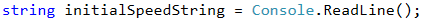
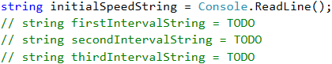
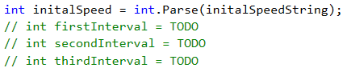
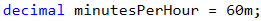
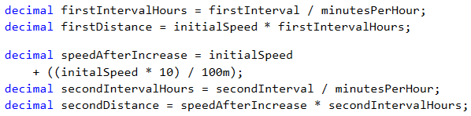
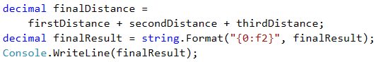

# Problem: Distance

Write a program that calculates **what is the distance passed by a car (in kilometers)**, if we know **the initial speed** (km/h), **the initial time frame** in minutes, then the **speed is increased by 10%**, **the second time frame**, then the **speed is decreased by 5%**, and the **time until the end** of the trip. In order to calculate the distance, you need to **convert the minutes into hours** (for example 70 minutes = 1.1666 hours).

## Input Data

The input comes from the console and consists of **4 lines**:

* The **initial speed** in km/h – an integer within the range \[**1 … 300**].
* The **first time frame** in minutes – an integer within the range \[**1 … 1000**].
* The **second time frame** in minutes – an integer within the range \[**1 … 1000**].
* The **third time frame** in minutes – an integer within the range \[**1 … 1000**].

## Output Data

Print a number on the console: **the kilometers passed**, formatted up to the **second digit after the decimal point**.

## Sample Input and Output

| Input                       | Output | Comments                                                                                                                                                                                                                                                                                                                                                                                                               |
| --------------------------- | ------ | ---------------------------------------------------------------------------------------------------------------------------------------------------------------------------------------------------------------------------------------------------------------------------------------------------------------------------------------------------------------------------------------------------------------------- |
| 
90 60 70 80
 | 330.90 | 
<strong>Distance with initial speed</strong>: 90 km/h * 1 hour (60 min) = <strong>90 km</strong> <strong>After speed increase</strong>: 90 + 10% = 99.00 km/h * 1.166 hours (70 min) = <strong>115.50 km</strong> <strong>After speed decrease</strong>: 99 - 5% = 94.05 km/h * 1.33 hours (80 min) = <strong>125.40 km</strong> <strong>Total number of km passed</strong>: <strong>330.9 km</strong>
 |

| Input                          | Output | Comments                                                                                                                                                                                                                                                                                                                                                                                                                                  |
| ------------------------------ | ------ | ----------------------------------------------------------------------------------------------------------------------------------------------------------------------------------------------------------------------------------------------------------------------------------------------------------------------------------------------------------------------------------------------------------------------------------------- |
| 
140 112 75 190
 | 917.12 | 
<strong>Distance with initial speed</strong>: 140 km/h * 1.86 hours (112 min) = <strong>261.33 km</strong> <strong>After speed increase</strong>: 140 + 10% = 154.00 km/h * 1.25 hours (75 min) = <strong>192.5 km</strong> <strong>After speed decrease</strong>: 154.00 - 5% = 146.29 km/h * 3.16 hours (190 min) = <strong>463.28 km</strong> <strong>Total number of km passed</strong>: <strong>917.1166 km</strong>
 |

## Hints and Guidelines

It is possible that such a description may look **misleading** and incomplete at first glance, which **adds** to the **complexity** of a relatively easy task. Let's **separate** the problem into a few **sub-problems** and try to **solve** each of them one by one, which will lead us to the final result:

* Our **initial** sub-problem will be to **read the input data** entered by the user, and **store them in appropriate variables**.
* **Execution** of the main programming **logic**, which in our case is a batch of simple calculations of the properties that we already have.
* **Calculation** and shaping up the end **result**.

**The main** part of the programming logic **is** to **calculate** what will be the **distance passed after all changes** in speed. As during **execution** of the program, part of the **data** that we have **is modified**, we could **separate** the program **code** into a few **logically** separated **parts**:

* **Calculation** of the **distance** passed with initial speed.
* Change of **speed** and calculation of the **distance** passed.
* Last change of **speed** and **calculation**.
* **Summing up**.

### Reading the Input Data

We use the following **function** to **read** the data from the **console**:

By definition, **the input data** is given as **four** separate lines. This is why we need to execute **the previous** code **four** times in total.

### Selecting Data Type for Calculations

In order to **perform** the **calculations**, we select **`decimal`** type.

|  | The data type for real numbers with decimal representation in C# is the 128-bit `decimal` type. It has the accuracy of 28 to 29 decimal numbers. Its minimum value is -7.9×10^28, and its maximum value is +7.9×10^28. Its default value is 0.0m or 0.0M. The `m` symbol at the end explicitly indicates that the number is `decimal` type (by default all real numbers are `double` type). The numbers closest to 0 that can be stored in `decimal` are ±1.0 × 10^-28. It is evident that `decimal` cannot store very large positive and negative numbers (for example with hundreds of digits), nor values very close to 0. On the other hand, this type rarely causes any errors upon financial calculations because it represents the numbers as a sum of the power of the number 10, upon which the round-off errors are much less compared to when we use binary representation. Real numbers of `decimal` type are exceptionally suitable for performing monetary calculations – calculation of incomes, liabilities, taxes, interest, etc. |
| ----------------------------------- | -------------------------------------------------------------------------------------------------------------------------------------------------------------------------------------------------------------------------------------------------------------------------------------------------------------------------------------------------------------------------------------------------------------------------------------------------------------------------------------------------------------------------------------------------------------------------------------------------------------------------------------------------------------------------------------------------------------------------------------------------------------------------------------------------------------------------------------------------------------------------------------------------------------------------------------------------------------------------------------------------------------------------------------------------- |

This way we solved successfully the **first sub-problem**.

### Converting the Input Data into Appropriate Types

**The next** step is to **convert the input data** into appropriate **types**, in order to be able to perform the needed calculations. We select **`Int32`** or **`int`** as an appropriate type, because the condition of the problem says that the input data must be within a **particular range**, for which this data type is completely sufficient. We will do the **conversion** in the following way:

### Helper Variable

We initially **store** one **variable** that will be used multiple times. This centralization approach gives us **flexibility** and **possibility** to **modify** the end result of the program with minimum efforts. In case we need to change the value, we must do it in **only once place in the code**, which saves us time and effort.

|  | **Avoiding repetitive code** (centralization of the program logic) in the tasks that we examine in the present book may look unnecessary at first glance, but this approach is very important upon building large applications in a real work environment, and its exercising in an initial stage of training will help you build a quality programming style. |
| ----------------------------------- | -------------------------------------------------------------------------------------------------------------------------------------------------------------------------------------------------------------------------------------------------------------------------------------------------------------------------------------------------------------- |

### Calculating Travel Distance

We calculate the **travel time** (in hours) by **dividing the time by 60** (minutes in an hour). The **travel distance** is calculated by **multiplying the starting speed by the time passed** (in hours). After that we change the speed by increasing it by **10%**, as per the task description. Calculating the **percentage**, as well as the following **distances** passed, is done in the following way:

* **The time frame** (in hours) is calculated by **dividing** the provided time frame in minutes by the minutes that are contained in an hour (60).
* **The distance passed** is calculated by **multiplying** the time frame (in hours) by the speed that is obtained after the increase.
* The next step is to **decrease the speed** by **5%**, as per the problem description.
* We calculate the **remaining distance** in the manner described in the first two points.

### Calculating and Printing the Output

Up until now we were able to **solve two** of the **most important sub-problems**, namely the **data input** and **their processing**. What remains is to **calculate the end result**. As by the description we are required to **format it** up to **2** symbols after the decimal point, we can do this in the following **manner**:

If you worked accurately and wrote the program using the input data given in the task description, you will be convinced that it works properly.

## Testing in the Judge System

Test your solution here: [https://judge.softuni.org/Contests/Practice/Index/517#0](https://judge.softuni.org/Contests/Practice/Index/517#0).
