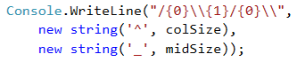
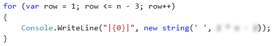
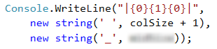
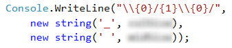

# Problem: Drawing a Fort

Write a program that reads from the console **an integer n** and draws **a fort** **2 \* n columns** wide and **n rows** tall, as in the examples below. The left and right columns inside are **n / 2** wide.

## Input Data

The input is **an integer n** within the range \[**3 … 1000**].

## Output Data

Print on the console **n** text rows, depicting **the fort** exactly as in the examples.

## Sample Input and Output

| Input | Output                                                                   | Input | Output                                                                                                      |
| ----- | ------------------------------------------------------------------------ | ----- | ----------------------------------------------------------------------------------------------------------- |
| 3     | 
<code>/^\/^\</code> <code>|    |</code> <code>\_/\_/</code>
 | 4     | 
<code>/^^\/^^\</code> <code>|      |</code> <code>|      |</code> <code>\__/\__/</code> 
 |

| Input | Output                                                                                                                                         | Input | Output                                                                                                                                                                                                                                                                          |
| ----- | ---------------------------------------------------------------------------------------------------------------------------------------------- | ----- | ------------------------------------------------------------------------------------------------------------------------------------------------------------------------------------------------------------------------------------------------------------------------------- |
| 5     | 
<code>/^^\__/^^\</code> <code>|        |</code> <code>|        |</code> <code>|   __   |</code> <code>\__/  \__/</code> 
 | 8     | 
<code>/^^^^\____/^^^^\</code> <code>|              |</code> <code>|              |</code> <code>|              |</code> <code>|              |</code> <code>|              |</code> <code>|     ____     |</code> <code>\____/    \____/</code> 
 |

## Hints and Guidelines

Let’s solve the problem step by step: read the input, perform some calculations, print the fort roof, print the fort body, print the fort base.

### Reading the Input Data

We can see from the explanation that **the input data** will be only one line which will contain **an integer** within the range \[**3 … 1000**]. Therefore, we will use **a variable** of **`int`** type.

After we have declared and initialized the input data, we must divide **the fort** into three parts:

* roof
* body
* base

### Calculating and Printing the Roof

We can see from the examples that **the roof** is made of **two towers** and **a middle part**. Each tower has a beginning **`/`**, middle part **`^`** and an end **`\`**.

|  | **`\`** is a special symbol in C# and using only it in the method **`Console.WriteLine(…)`**, the console will not print it, that's why we show with **`\\`** that we want to print exactly this symbol, without being interpreted as a special symbol (this is called "character escaping"). |
| ----------------------------- | --------------------------------------------------------------------------------------------------------------------------------------------------------------------------------------------------------------------------------------------------------------------------------------------- |

The size of the middle part is **`n / 2`**, therefore we can write this value in a new **variable**. It will keep **the size** of **the middle part of the tower**.

Now we declare a second **variable**, in which will keep **the value** of the part **between the two towers**. The middle part of the roofs has a size of **`2 * n - 2 * colSize - 4`**.

In order to print **the roof**, we will use **`new string`**, which takes two parameters **`(char, int)`** and connects a symbol **n** times.

### Printing the Body of the Fort

**The body of the fort** contains a beginning **`|`**, a middle part **`(white space)`** and an end **`|`**. **The middle part** is a blank space with size of **`2 * n - 2`**. The number of **the rows** used for walls can be found in the given parameters: **`n - 3`**. This code prints the body of the fort:

### Printing the Base of the Fort

In order to draw the last but one row, which is a part of the base, we need to print a beginning **`|`**, middle part **`(white space)_(white space)`** and an end **`|`**. In order to do this, we can use the already declared variables **`colSize`** and **`midSize`** again, because we can see from the examples that they are equal to the **`_`** in the roof.

We add **`+ 1`** to the **white spaces**, because we have **one** white space more in the examples.

The structure of **the base of the fort** is the same as the one of **the roof**. It is made of **two towers** and **a middle part**. Each **tower** begins with **`\`**, then a middle part **`_`** and an end **`/`**.

## Testing in the Judge System

Test your solution here: [https://judge.softuni.org/Contests/Practice/Index/513#0](https://judge.softuni.org/Contests/Practice/Index/513#0).
