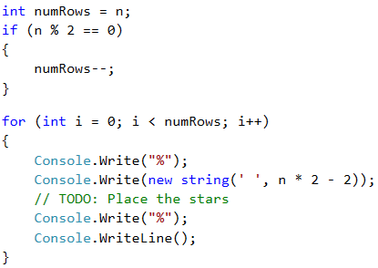
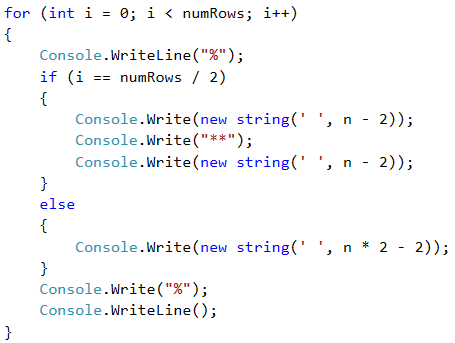

# Problem: Rectangle with Stars

The next sample exam problem is about using nested loops and calculations to print on the console a rectangle of given size with stars in the middle, like the ones shown below in the examples.

## Video: Rectangle with Stars in the Center

Watch the video lesson about solving the "Rectangle with Stars in the Center" problem: https://youtu.be/6cOJDJm6sNk.

## Problem Description

Write a program that reads from the console an integer **n** and draws a **rectangle** with size **n with two asterisks is its center** as in the examples below.

## Input

The input is an integer **n** in the range \[**2 … 1000**].

## Output

The rectangle should be printed on the console as in the examples below.

## Sample Input and Output

| Input | Output                                                                 | Input | Output                                                                                                                     |
| ----- | ---------------------------------------------------------------------- | ----- | -------------------------------------------------------------------------------------------------------------------------- |
| 2     | 
<code>%%%%</code> <code>%**%</code> <code>%%%%</code> 
 | 3     | 
<code>%%%%%%</code> <code>%    %</code> <code>% ** %</code> <code>%    %</code> <code>%%%%%%</code> 
 |

| Input | Output                                                                                                                               | Input | Output                                                                                                                                                                                               |
| ----- | ------------------------------------------------------------------------------------------------------------------------------------ | ----- | ---------------------------------------------------------------------------------------------------------------------------------------------------------------------------------------------------- |
| 4     | 
<code>%%%%%%%%</code> <code>%      %</code> <code>%  **  %</code> <code>%      %</code> <code>%%%%%%%%</code> 
 | 5     | 
<code>%%%%%%%%%%</code> <code>%        %</code> <code>%        %</code> <code>%   **   %</code> <code>%        %</code> <code>%        %</code> <code>%%%%%%%%%%</code> 
 |

## Reading the Input Data

We read the input data.

## Printing the First and the Last Rows

The first thing we can easily notice is that **the first and last rows** contain **`2 * n`** symbols **`%`**. We will start with this and then draw the middle part of the rectangle.

## Printing the Middle Rows

From the examples we see that **the middle** part of the figure always has **odd number** of rows. Note that when an **even number** is set, the number of rows is equal to **the previous odd** number (2 -> 1, 4 -> 3, etc.). We create a variable that represents the number of rows that our rectangle will have, and correct it if the number **`n` is even**. Then we will draw a **rectangle without the asterisks**. Each row has for **the beginning and the end** the symbol **`%`** and between them **2 \* n - 2** empty spaces (the width is **`2 * n`** and we subtract 2 for the two percent at the end). Do not forget to move the code for the **last line after the loop**.

We can **start and test the code so far**. Everything without the two asterisks in the middle should work correctly.

## Adding Stars in the Center of the Rectangle

Now, **in the body** of the loop let's add the **asterisks**. We'll check if we're on the **middle row**. If we are in the middle, we will draw **the row** together **with the asterisks**, if not – we will draw **a normal row**. The line with the asterisks has **`n-2` empty spaces** (**`n`** is half the length and we remove the asterisk and the percentage), **two stars** and again **`n-2` empty spaces**. We leave out of the check the two percent at the beginning and at the end of the row.

## Testing in the Judge System

Test your solution here: [https://judge.softuni.org/Contests/Practice/Index/516#9](https://judge.softuni.org/Contests/Practice/Index/516#9).
