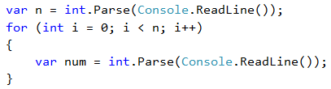
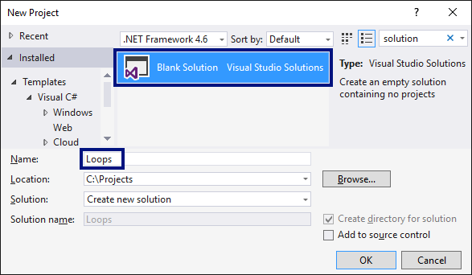

# Exercises: Loops

Now that we are familiar with loops, it is time **to practice our newly acquired skills**, and as you know, this is achieved by a lot of code writing. Let's solve some **practical problems**.

## Video: Chapter Summary

Watch this video to review what we learned in this chapter: [https://youtu.be/4G\_oSUcx9ko](https://youtu.be/4G\_oSUcx9ko).

## What We Learned in This Chapter?

We can repeat a code block using a `for`\*\* loop\*\*:

We can read a sequence of `n` numbers from the console this way:

## Blank Solution in Visual Studio

Before starting with the exercises, we will create a **Visual Studio solution** with the idea to hold the code for each exercises problem in a **separate C# project** inside the solution.

Create a **(Blank Solution)** in Visual Studio:

Set it up to **start the current project by default** (not the first one in the solution). Do that by right clicking on **Solution 'Loops'** -> \[**Set StartUp Projects…**] -> \[**Current selection**].

## The Problems

Now it's time to start working on the problems:

* [Problem: Summing up Numbers](example-sum-numbers.md)
* [Problem: The Max Number](example-max-number.md)
* [Problem: The Min Number](example-min-number.md)
* [Problem: Left and Right Sum](example-left-and-right-sum.md)
* [Problem: Even / Odd Sum](example-even-odd-sum.md)
* [Problem: Summing up Vowels](example-vowels-sum.md)
* [Problem: Element Equal to the Sum of the Rest](half-sum-element.md)
* [Problem: Even / Odd Positions](even-odd-positions.md)
* [Problem: Equal Pairs](equal-pairs.md)
