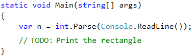

# \* Problem: Square of Stars

Write a C# console program that **reads** from the console **an integer N** and **prints** on the console **a square made out of N stars**, like in the examples below.

## Sample Input and Output

| Input | Output                                                          | Input | Output                                                                                  | Input | Output                                                                                                            |
| ----- | --------------------------------------------------------------- | ----- | --------------------------------------------------------------------------------------- | ----- | ----------------------------------------------------------------------------------------------------------------- |
| 3     | 
<code>***</code> <code>* *</code> <code>***</code>
 | 4     | 
<code>****</code> <code>*  *</code> <code>*  *</code> <code>****</code>
 | 5     | 
<code>*****</code> <code>*   *</code> <code>*   *</code> <code>*   *</code> <code>*****</code>
 |

## Video: Problem "Square of Stars"

Watch a video lesson to learn how to solve the "Square of Stars" problem step by step: https://youtu.be/zaj-DRbaHaI.

## Hints and Guidelines

Create a new **console C# program**. To read the number N (2 ≤ N ≤100), use the following code:

Finish the program above, so that it prints a square, made out of stars. It might be necessary to use **`for`** loops. Look for information on the Internet.

**Attention**: this task is harder than the rest and is given now on purpose, and it's marked with a star, in order to provoke you to look for information on the Internet. This is one of the most important skills that you have to develop while you're learning programming: **looking for information on the Internet**. This is what you're going to do every day, if you work as a developer, so don't be scared, try it out. If you have any difficulties, you can also ask for help in the SoftUni official **discussion forum** (https://www.reddit.com/r/softuni) or in the SoftUni official **Facebook page** (https://fb.com/softuni.org).

## Testing in the Judge System

Test your solution here: [https://judge.softuni.org/Contests/Practice/Index/503#5](https://judge.softuni.org/Contests/Practice/Index/503#5).
